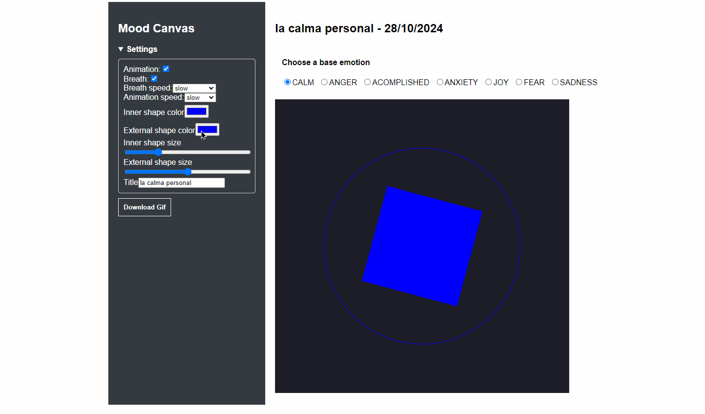

# Mood Canvas
Track yourself with art 🎨



Live demo 

## Description
**Mood Canvas** is a tool designed to help you track your mood using visual compositions. Each mood is associated with a specific shape, allowing you to overlay and create more complex figures. The emotions available are:

- Anger
- Anxiety
- Joy
- Accomplished
- Sad
- Fear
- Calm

These shapes can be combined to reflect complex emotional states.

## Main Functionalities
- **Shapes Composition**: Create your own composition using predefined emotional shapes. Each preset comes with customizable parameters, enabling you to personalize the visual piece according to your current mood.

## Installation

1. Clone the repository
```bash
   git clone <repository-url>
```

2. Navigate to the project directory
```bash
cd mood-canvas
```

3. Install the required libraries
```bash
npm install
```

4. Start the application:
```bash
npm start
```

## How to Use
- Select the emotion that best represents your current state (anger, anxiety, joy, etc.).
- Watch how the shapes associated with each emotion overlay and form a unique visual composition.
- Customize the shapes using available presets and parameters to reflect more complex emotional landscapes.

## Technologies Used
- JavaScript
- React (via Create React App)
- Processing.js for visual rendering

## License
This project is licensed under the MIT License. See the LICENSE file for more details.